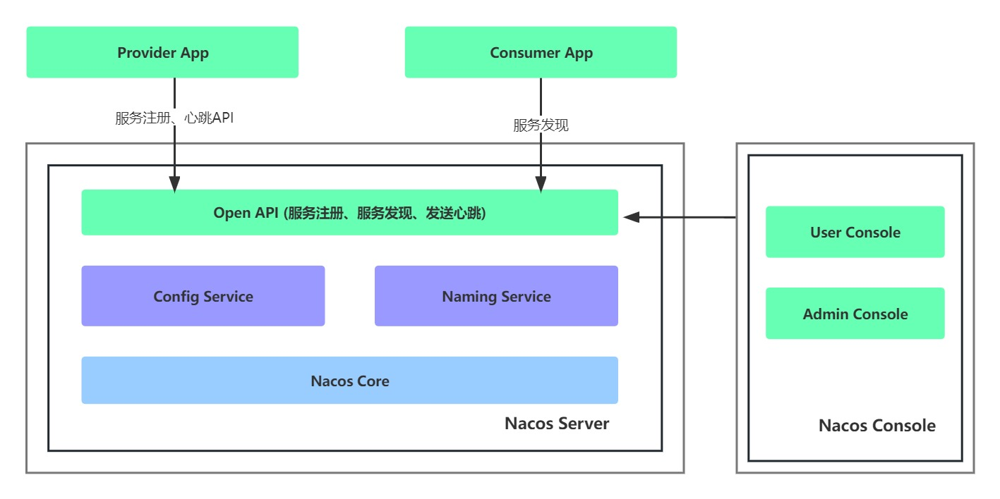
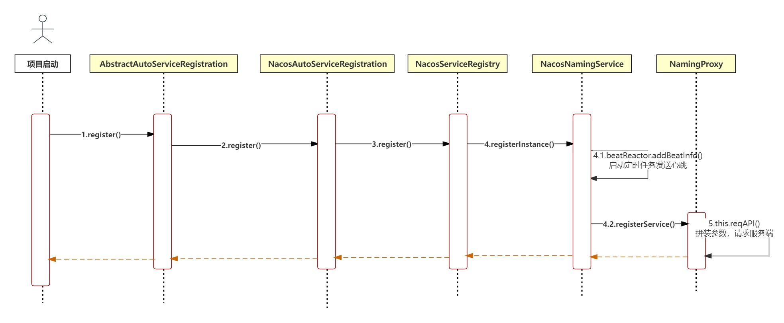
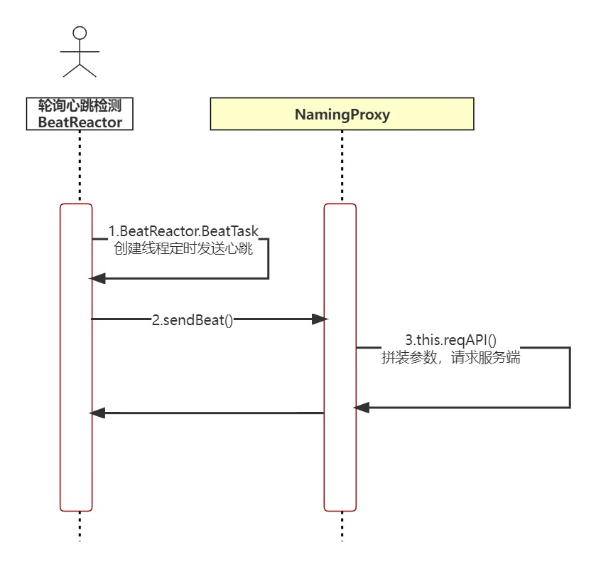
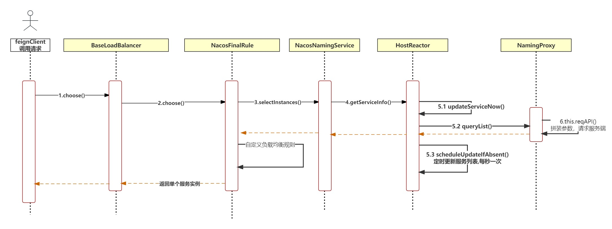

#  文档说明

#### 本节包含以下几部分内容。
1. [Nacos 概述](#概述)
2. [Nacos 基本使用](#基本使用)
3. [Nacos 注册中心原理](#注册中心原理)
4. [Nacos 注册中心源码解析](#注册中心原理)
5. [Nacos 自定义服务发现策略](#自定义服务发现策略)


##  概述
#### [Nacos](https://github.com/alibaba/nacos) 是阿里巴巴的开源项目，包含注册中心与配置中心，于2018 年 7 月正式发布，github star 26.3k。
#### 2018 年 10 月 [spring-cloud-alibaba](https://github.com/alibaba/spring-cloud-alibaba) 分布式解决方案全家桶通过Spring孵化，正式开源，github star 25.5k。Nacos为其中一个组件，它还包括限流降级Sentinel、分布式事务Seata等组件。

#### 主流注册中心对比:

|       | Nacos | Eureka | Zookeeper | Consul |
|:------|:------|:-------|:----------|:-------|
| 版本迭代  | √     | ×      | √         | √      |
| 雪崩保护 | 支持 | 支持     | 不支持       | 不支持    |
| SpringCloud集成 | 支持 | 支持     | 不支持       | 支持     | 
| Dubbo集成 | 支持 | 不支持    | 支持        | 不支持    | 
| K8s集成 | 支持 | 不支持    | 不支持       | 支持     | 
| CAP定理 | AP或CP | AP     | CP        | CP     |


?>  CAP定理： 一致性（C），可用性（A），分区容错性（P）

##  基本使用
#### Nacos服务端安装
> 步骤一： 进入[Nacos下载页](https://github.com/alibaba/nacos/releases) ，下载并解压`nacos-server-2.2.2.zip`，进入`nacos\conf\application.properties`中配置使用mysql持久化数据库
> ,双击nacos\bin\startup.cmd，出现以下提示则成功


> 步骤二： 进入nacos控制台验证是否可成功访问  
> http://localhost:8848/nacos 默认用户名：nacos 密码：nacos


#### 将服务注册到Nacos
> 步骤三： 添加pom依赖、
```xml
<dependency>
  <groupId>com.alibaba.cloud</groupId>
  <artifactId>spring-cloud-starter-alibaba-nacos-discovery</artifactId>
</dependency>
<dependencyManagement>
    <dependencies>
        <!--springcloud依赖-->
        <dependency>
            <groupId>org.springframework.cloud</groupId>
            <artifactId>spring-cloud-dependencies</artifactId>
            <version>Greenwich.SR3</version>
            <type>pom</type>
            <scope>import</scope>
        </dependency>
    
        <!--springcloud-alibaba依赖-->
        <dependency>
            <groupId>com.alibaba.cloud</groupId>
            <artifactId>spring-cloud-alibaba-dependencies</artifactId>
            <version>2.1.0.RELEASE</version>
            <type>pom</type>
            <scope>import</scope>
        </dependency>
    </dependencies>
</dependencyManagement>
```

> 步骤四： 添加Nacos配置中心地址
```yml
spring:
  cloud:
    nacos:
      discovery:
        server-addr: 127.0.0.1:8848
```

##  注册中心原理


> 以Nacos为例，其他注册中心组件原理相同。注册中心可以看做CS结构，[服务注册](#服务注册)、[健康检查](#健康检查)、[服务发现](#服务发现)这些核心特性本质就是客户端使用HttpClient请求服务端接口，进行服务的维护。
> 服务提供者将服务注册到nacos上，服务消费者使用别名调用open api获取服务的实例列表

###  服务注册



1. 首先Nacos中实现服务注册接口，并在`META-INF/spring.factories`中提供`SPI`机制接口配置类`NacosDiscoveryAutoConfiguration`
2. SpringBoot启动时，Spring会注入Nacos服务注册实现类，调用`AbstractAutoServiceRegistration.register() -> NacosAutoServiceRegistration.register() -> NacosServiceRegistry.register()`
3. `NacosServiceRegistry.register() -> NacosNamingService.registerInstance()`启动健康检查定时任务，并注册服务
4. `NacosNamingService.registerInstance() -> NamingProxy.registerService() -> NamingProxy.reqAPI()`发送服务注册请求

### 健康检查



1. 服务注册成功后会启动心跳检测定时任务，默认每5秒一次。`NacosNamingService.registerInstance() -> BeatReactor.addBeatInfo()`
2. 心跳检测实现：创建线程 -> `NamingProxy.sendBeat()`,最终依然是使用`NamingProxy.reqAPI()`发送心跳请求，根据服务响应间隔时间轮训这个步骤

### 服务发现



1. 客户A通过`FeignClient`指定服务名称调用服务B，因为`FeignClient`中内置了`netflix`的`ribbon`做客户端负载均衡,所以会通过`ribbon`负载均衡策略进行服务发现
2. 以`Nacos`内置的负载均衡策略`NacosRule.class`为例,首先获取注入`NacosDiscoveryProperties`，该对象可以获取到查询服务实例的对象`NamingService`
3. `NamingService.selectInstances(name, true) -> NacosNamingService.selectInstances()`查询指定服务名称的示例列表
4. `NacosNamingService.selectInstances() -> HostReactor.getServiceInfo()` 去查询内存中存储的服务实例。
如果服务实例不存在则调用`hostReactor.updateServiceNow() `实时查询服务实例并缓存。首次调用服务会启动定时任务`hostReactor.scheduleUpdateIfAbsent()`，每秒查询一次服务状态并更新缓存
5. `NamingService.selectInstances(name, true)`拿到服务实例后，客户端侧可以根据规则自定义负载均衡策略

##  自定义服务发现策略
```java

/**
 * 负载均衡规则：
 * 调用指定集群（若指定集群不存在则使用其他集群）下指定版本的服务列表后根据权重负载均衡
 */
@Slf4j
public class NacosFinalRule extends AbstractLoadBalancerRule {
    @Autowired
    private NacosDiscoveryProperties nacosDiscoveryProperties;

    @Override
    public Server choose(Object key) {

        // 1. 查询所有实例
        // 2. 筛选元数据匹配的实例
        // 3. 筛选出同cluster下元数据匹配的实例
        // 4. 如果3为空，就用2
        // 5. 权重选择实例
        try {
            String clusterName = this.nacosDiscoveryProperties.getClusterName();
            String targetVersion = this.nacosDiscoveryProperties.getMetadata().get("version");

            DynamicServerListLoadBalancer loadBalancer = (DynamicServerListLoadBalancer) getLoadBalancer();
            String name = loadBalancer.getName();

            NamingService namingService = this.nacosDiscoveryProperties.namingServiceInstance();

            // 所有实例
            List<Instance> instances = namingService.selectInstances(name, true);

            List<Instance> metadataMatchInstances = instances;
            // 如果配置了版本映射，那么只调用元数据匹配的实例
            if (StringUtils.isNotBlank(targetVersion)) {
                metadataMatchInstances = instances.stream()
                        .filter(instance -> Objects.equals(targetVersion, instance.getMetadata().get("version")))
                        .collect(Collectors.toList());
                if (CollectionUtils.isEmpty(metadataMatchInstances)) {
                    log.warn("未找到元数据匹配的目标实例！请检查配置。targetVersion = {}, instance = {}", targetVersion, instances);
                    return null;
                }
            }

            List<Instance> clusterMetadataMatchInstances = metadataMatchInstances;
            // 如果配置了集群名称，需筛选同集群下元数据匹配的实例
            if (StringUtils.isNotBlank(clusterName)) {
                clusterMetadataMatchInstances = metadataMatchInstances.stream()
                        .filter(instance -> Objects.equals(clusterName, instance.getClusterName()))
                        .collect(Collectors.toList());
                if (CollectionUtils.isEmpty(clusterMetadataMatchInstances)) {
                    clusterMetadataMatchInstances = metadataMatchInstances;
                    log.warn("发生跨集群调用。clusterName = {}, targetVersion = {}, clusterMetadataMatchInstances = {}", clusterName, targetVersion, clusterMetadataMatchInstances);
                }
            }
            Instance instance = ExtendBalancer.getHostByRandomWeight2(clusterMetadataMatchInstances);
            return new NacosServer(instance);
        } catch (Exception e) {
            log.warn("发生异常", e);
            return null;
        }
    }

    @Override
    public void initWithNiwsConfig(IClientConfig iClientConfig) {
    }
}
```