#  快速开发指南

#### 本节包含以下几部分内容。
- [开发环境说明](#开发环境说明)
- [微服务API开发](#微服务API开发)
- [WebService开发](#WebService开发)
- [工作流开发](#工作流开发)
- [大数据API开发](#大数据API开发)
- [网关路由配置](#网关路由配置)
- [限流降级配置](#限流降级配置)
- [分布式事务配置](#分布式事务配置)
- [多租户配置](#多租户配置)
- [单点登录服务配置](#单点登录服务配置)
- [easycode代码生成](#easycode代码生成)
- [mqtt消息推送](#mqtt消息推送)
- [个推消息推送](#个推消息推送)
- [短信消息推送](#短信消息推送)
- [邮箱消息推送](#邮箱消息推送)
- [分布式定时调度](#分布式定时调度)
- [搜索引擎solr](#搜索引擎solr)

##  开发环境说明
- 已安装 JDK 1.8.0_172 及以上版本，并且已经设置 JAVA_HOME 以及 PATH 系统变量。
- 已下载 此文档中提供的百度云链接地址中的中间件,并安装测试成功。
- 本场景满足如下软硬件配置。
| 项目 | 说明 |
| :-----| :---- |
| CPU | 主频2.0GHz以上 |
| 内存 | 8GB以上 |
| 硬盘 | 安装目录空间：2GB以上  |
| 操作系统 | Windows 10 |
| JDK | 1.8 |
| 浏览器 | Chrome   |
- 本场景平台部署说明示例如下。
| 系统 | URL |
| :-----| :---- |
| nacos注册中心 | http://127.0.0.1:8848 |
| nacos配置中心 | http://127.0.0.1:8848 |
| gateway服务网关 | http://127.0.0.1:8090  |
| sentinel熔断降级 | http//127.0.0.1:8080 |
| admin服务监控 | http://127.0.0.1:8880 |
| zipkin调用链监控 | http://127.0.0.1:9411   |
| elasticsearch | http://127.0.0.1:9200   |
| logstash | http://127.0.0.1:9600   |
| kibana日志中心 | http://127.0.0.1:5601 |
| SSO单点登录服务 | http://127.0.0.1:8050  |
| redis | http://127.0.0.1:6379   |
| hadoop | /   |
| zookeeper | /   |
| hbase | /   |
| phoenix | /   |
| 用户中心模块 | http://127.0.0.1:8090/cloud-system |
| 内容中心模块 | http://127.0.0.1:8090/cloud-content |
| BPM流程中心模块 | http://127.0.0.1:8090/cloud-process |
| 大数据模块 | http://127.0.0.1:8090/cloud-bigdata |
| 用户中心数据库 | 127.0.0.1:3306/user_center |
| 内容中心数据库 | 127.0.0.1:3306/content_center |
| BPM流程中心数据库 | 127.0.0.1:3306/process_center |

## 微服务API开发
> 步骤一： 以user-center为例，将需要操作的单表通过代码生成插件对我们预先定义的增删改查模板进行代码生成，
> 生成之后我们就可以通过客户端来调用此服务中的接口了，Controller层代码如下
```java
package com.zzqx.springcloud.system.Controller;
import com.baomidou.mybatisplus.core.conditions.query.QueryWrapper;
import com.baomidou.mybatisplus.extension.plugins.pagination.Page;
import com.zzqx.springcloud.common.util.ResponseInfo;
import com.zzqx.springcloud.system.domain.model.TestTable;
import com.zzqx.springcloud.system.service.TestTableService;
import org.springframework.web.bind.annotation.*;

import org.springframework.beans.factory.annotation.Autowired;
import java.io.Serializable;
import java.util.List;

/**
 * test table(TestTable)表控制层
 *
 * @author chende
 * @since 2020-04-05 15:01:46
 */
@RestController
@RequestMapping("testTable")
public class TestTableController {
    /**
     * 服务对象
     */
    @Autowired
    private TestTableService testTableService;

    /**
     * 分页查询所有数据
     *
     * @param page 分页对象
     * @param testTable 查询实体
     * @return 所有数据
     */
    @GetMapping
    public ResponseInfo selectAll(Page<TestTable> page, TestTable testTable) {
        return ResponseInfo.success(this.testTableService.page(page, new QueryWrapper<>()));
    }

    /**
     * 通过主键查询单条数据
     *
     * @param id 主键
     * @return 单条数据
     */
    @GetMapping("{id}")
    public ResponseInfo selectOne(@PathVariable Serializable id) {
        return ResponseInfo.success(this.testTableService.getById(id));
    }

    /**
     * 新增数据
     *
     * @param testTable 实体对象
     * @return 新增结果
     */
    @PostMapping
    public ResponseInfo insert(@RequestBody TestTable testTable) {
        return ResponseInfo.success(this.testTableService.save(testTable));
    }

    /**
     * 修改数据
     *
     * @param testTable 实体对象
     * @return 修改结果
     */
    @PutMapping
    public ResponseInfo update(@RequestBody TestTable testTable) {
        return ResponseInfo.success(this.testTableService.updateById(testTable));
    }

    /**
     * 删除数据
     *
     * @param idList 主键结合
     * @return 删除结果
     */
    @DeleteMapping
    public ResponseInfo delete(@RequestParam("idList") List<Long> idList) {
        return ResponseInfo.success(this.testTableService.removeByIds(idList));
    }
}
```

> 步骤二： 如果此服务中的接口需要暴露给nacos注册中心中的其他服务调用的话，那么我们需要将服务提供方想要
> 暴露的api接口定义在interface模块下的对应子模块user-interface中，这个子模块中只需要定义实体类与接口，
> 然后我们需要在user-center中的Controller层实现接口，并且在model实体中继承user-interface的实体类。

> 步骤三： 在服务调用方需要去定义一个user-interface中定义的接口的实现类A类，并配置feign映射注解，然后我们就可以
> 在Controller层中注入A类并且调用对应feign配置服务的接口了。  
> 这里给出一个feign配置的demo代码

```java
package com.zzqx.springcloud.system.feignclient.api.contentcenter;

import com.zzqx.springcloud.facade.contentcenter.api.NoticeApi;
import com.zzqx.springcloud.facade.contentcenter.model.BaseNotice;
import com.zzqx.springcloud.system.feignclient.fallback.NoticeFeignClientFallback;
import org.springframework.cloud.openfeign.FeignClient;
import org.springframework.cloud.openfeign.SpringQueryMap;
import org.springframework.web.bind.annotation.*;

import java.util.List;

/**
 * feign面向接口远程调用多种参数形式
 */
@FeignClient(value = "cloud-content",fallbackFactory = NoticeFeignClientFallback.class)
public interface NoticeFeignClient extends NoticeApi<BaseNotice> {

    /**
     * 空参数调用
     * @return
     */
    @RequestMapping("notice/list")
    public List<BaseNotice> noticeList();

    /**
     * 对象封装的调用
     * @param notice
     * @return
     */
    @PostMapping("notice/save")
    public  Boolean save(@RequestBody BaseNotice notice);

    /**
     * 多参数调用
     * @param username
     * @param password
     * @return
     */
    @GetMapping("notice/getParam")
    public String getParam(@RequestParam("username") String username, @RequestParam("password") String password);

    /**
     * url中的参数与springmvc相同
     */
    @GetMapping("notice/get/{id}")
    public String getSingleParam(@PathVariable String id);
}
```

## WebService开发
?> WebService代码在soa-center子模块中，我们将WebService写在对应模块中，WebService有两种实现方式： rest方式/soap方式
> rest风格WebService如下  
> 步骤一：定义WebService接口 

```java
package com.zzqx.springcloud.userservice.webservice.rs;


import javax.ws.rs.*;

@Path(value = "/UserInfoServiceRS")
public interface UserInfoServiceRS {
	@GET
	@Path(value = "/{id}/info")
	@Produces({"application/json","application/xml"})
	String findUserInfoById(@PathParam("id") String id);

	@GET
	@Path(value = "/search")
	@Produces({"application/json","application/xml"})
	String findAll();

	@POST
	@Path(value = "/login")
	@Produces({"application/json","application/xml"})
	String login(@QueryParam("userName")String userName , @QueryParam("password")String password);

	@POST
	@Path(value = "/authentication")
	@Produces({"application/json"})
	String authentication(@HeaderParam("token") String token);
}

```

> 步骤二：定义WebService接口的实现类
```java
package com.zzqx.springcloud.userservice.webservice.rs.impl;

import com.alibaba.fastjson.JSON;
import com.alibaba.fastjson.serializer.SerializerFeature;
import com.baomidou.mybatisplus.core.conditions.query.LambdaQueryWrapper;
import com.baomidou.mybatisplus.core.conditions.query.QueryWrapper;
import com.google.common.collect.Maps;
import com.zzqx.springcloud.commonservice.constant.GlobalConstant;
import com.zzqx.springcloud.commonservice.domain.dto.ResponseInfo;
import com.zzqx.springcloud.commonservice.util.JwtOperator;
import com.zzqx.springcloud.userservice.domain.model.UserInfo;
import com.zzqx.springcloud.userservice.service.UserInfoService;
import com.zzqx.springcloud.userservice.webservice.rs.UserInfoServiceRS;
import io.jsonwebtoken.Claims;
import io.swagger.annotations.Api;
import org.apache.commons.lang3.StringUtils;
import org.springframework.beans.factory.annotation.Autowired;
import org.springframework.beans.factory.annotation.Value;
import org.springframework.data.redis.core.RedisTemplate;
import org.springframework.http.HttpStatus;
import org.springframework.stereotype.Service;

import java.util.List;
import java.util.Map;
import java.util.concurrent.TimeUnit;

@Api("/UserInfoServiceImplRS")
@Service
public class UserInfoServiceImplRS implements UserInfoServiceRS {
	@Autowired
	private UserInfoService userInfoService ;

	@Autowired
	private JwtOperator jwtOperator;

	@Autowired
	private RedisTemplate redisTemplate;

	@Value("${expire-time-in-second}")
	private Long tokenExpireSecond;

	@Override
	public String findUserInfoById(String id) {
		UserInfo userInfo = userInfoService.getById(id);
		ResponseInfo responseInfo = ResponseInfo.success(userInfo);
		return JSON.toJSONString(responseInfo, SerializerFeature.WriteMapNullValue);
	}

	@Override
	public String findAll() {
		List<UserInfo> list = userInfoService.list(new QueryWrapper<>());
		ResponseInfo responseInfo = ResponseInfo.success(list);
		return JSON.toJSONString(responseInfo, SerializerFeature.WriteMapNullValue);
	}

	@Override
	public String login(String userName, String password){
		if(StringUtils.isEmpty(userName) || StringUtils.isEmpty(password)){
			ResponseInfo responseInfo = ResponseInfo.error(HttpStatus.INTERNAL_SERVER_ERROR.value(),"无效参数");
			return JSON.toJSONString(responseInfo, SerializerFeature.WriteMapNullValue);
		}

		UserInfo userInfo = userInfoService.getOne(new LambdaQueryWrapper<UserInfo>()
				.eq(UserInfo::getUserName,userName)
				.eq(UserInfo::getPassword,password)
		);

		Map jwtMap = Maps.newHashMap();
		jwtMap.put("id", userInfo.getId());
		jwtMap.put("userName", userInfo.getUserName());
		jwtMap.put("role", userInfo.getRole());

		//生成jwtToken
		String tokenStr =  jwtOperator.generateToken(jwtMap);

		//三十分钟有效
		redisTemplate.opsForValue().set(GlobalConstant.PRE_TOKEN_STR + userInfo.getUserName(),tokenStr,tokenExpireSecond, TimeUnit.SECONDS);

		//统一响应
		ResponseInfo responseInfo = ResponseInfo.success(tokenStr,null);
		return JSON.toJSONString(responseInfo, SerializerFeature.WriteMapNullValue);
	}


	/**
	 * token认证
	 * @param token
	 * @return
	 */
	@Override
	public String authentication(String token) {
		String username = null ;
		boolean pass = true ;
		try {
			//验证token有效性
			if(StringUtils.isEmpty(token) ||  !jwtOperator.validateToken(token) ){
				pass = false;
			}
			if(pass){
				Claims claims = jwtOperator.getClaimsFromToken(token);
				username = claims.get("userName").toString();
				//验证缓存有效性
				if(!(redisTemplate.hasKey(GlobalConstant.PRE_TOKEN_STR + username)
						&& redisTemplate.opsForValue().get(GlobalConstant.PRE_TOKEN_STR + username).toString().equals(token))){
					pass = false;
				}
			}
		} catch (Exception e) {
			//统一响应
			ResponseInfo responseInfo = ResponseInfo.error(HttpStatus.INTERNAL_SERVER_ERROR.value(),e.getMessage(),pass);
			return JSON.toJSONString(responseInfo, SerializerFeature.WriteMapNullValue);
		}
		//统一响应
		ResponseInfo responseInfo = ResponseInfo.success(pass);
		return JSON.toJSONString(responseInfo, SerializerFeature.WriteMapNullValue);
	}
}

```

> 步骤三：在CXFConfig配置文件中修改发布WebService配置
```java
class CXFConfig{
    //JAX-RS发布
    	@Bean
    	public Server restfullServer() {
    		JAXRSServerFactoryBean endpoint = new JAXRSServerFactoryBean();
    		endpoint.setBus(springBus());
    		endpoint.setAddress("/MyServiceRS");
    		endpoint.setServiceBeans(Arrays.<Object>asList(userInfoServiceRS));
    		endpoint.setFeatures(Arrays.asList(new Swagger2Feature()));
    		return endpoint.create();
    	}
}
```

> soap协议WebService如下  
> 步骤一：定义RestService接口 
```java
package com.zzqx.springcloud.userservice.webservice.ws;


import javax.jws.WebMethod;
import javax.jws.WebParam;
import javax.jws.WebService;

@WebService(name = "UserInfoServiceWS", targetNamespace = "http://webservice.ws.zzqx.com/")
public interface UserInfoServiceWS {

	@WebMethod(action = "http://webservice.ws.zzqx.com/findUserInfoById")
	String findUserInfoById(@WebParam(name = "_para",targetNamespace = "http://webservice.ws.zzqx.com/") String _para);

	@WebMethod(action = "http://webservice.ws.zzqx.com/findAll")
	String findAll(@WebParam(name = "_para",targetNamespace = "http://webservice.ws.zzqx.com/") String _para);

	@WebMethod(action = "http://webservice.ws.zzqx.com/login")
	String login(@WebParam(name = "_para",targetNamespace = "http://webservice.ws.zzqx.com/") String _para);

	@WebMethod(action = "http://webservice.ws.zzqx.com/authentication")
	String authentication(@WebParam(name = "_para",targetNamespace = "http://webservice.ws.zzqx.com/") String _para);
}

```

> 步骤一：定义WebService接口的实现类
```java
package com.zzqx.springcloud.userservice.webservice.ws.impl;

import com.alibaba.fastjson.JSON;
import com.alibaba.fastjson.JSONObject;
import com.alibaba.fastjson.serializer.SerializerFeature;
import com.baomidou.mybatisplus.core.conditions.query.LambdaQueryWrapper;
import com.baomidou.mybatisplus.core.conditions.query.QueryWrapper;
import com.google.common.collect.Maps;
import com.zzqx.springcloud.commonservice.constant.GlobalConstant;
import com.zzqx.springcloud.commonservice.domain.dto.ResponseInfo;
import com.zzqx.springcloud.commonservice.util.JwtOperator;
import com.zzqx.springcloud.userservice.domain.model.UserInfo;
import com.zzqx.springcloud.userservice.service.UserInfoService;
import com.zzqx.springcloud.userservice.webservice.ws.UserInfoServiceWS;
import io.jsonwebtoken.Claims;
import org.apache.commons.lang3.StringUtils;
import org.springframework.beans.factory.annotation.Autowired;
import org.springframework.beans.factory.annotation.Value;
import org.springframework.data.redis.core.RedisTemplate;
import org.springframework.http.HttpStatus;
import org.springframework.stereotype.Component;

import javax.jws.WebService;
import java.util.List;
import java.util.Map;
import java.util.concurrent.TimeUnit;

@WebService(serviceName = "UserInfoServiceWS",
		targetNamespace = "http://webservice.ws.zzqx.com/",
		endpointInterface = "com.zzqx.springcloud.userservice.webservice.ws.UserInfoServiceWS"
)
@Component
public class UserInfoServiceImplWS implements UserInfoServiceWS {

	@Autowired
	private UserInfoService userInfoService ;

	@Autowired
	private JwtOperator jwtOperator;

	@Autowired
	private RedisTemplate redisTemplate;

	@Value("${expire-time-in-second}")
	private Long tokenExpireSecond;

	@Override
	public String findUserInfoById(String _para) {
		//参数转JSON
		JSONObject dataJson = JSONObject.parseObject(_para);

		//获取验证密钥
		String id = dataJson.getString("id");

		UserInfo userInfo = userInfoService.getById(id);
		//统一响应
		ResponseInfo responseInfo = ResponseInfo.success(userInfo);
		return JSON.toJSONString(responseInfo, SerializerFeature.WriteMapNullValue);
	}

	@Override
	public String findAll(String _para) {

		List<UserInfo> list = userInfoService.list(new QueryWrapper<>());
		//统一响应
		ResponseInfo responseInfo = ResponseInfo.success(list);
		return JSON.toJSONString(responseInfo, SerializerFeature.WriteMapNullValue);
	}

	@Override
	public String login(String _para) {

		//参数转JSON
		JSONObject dataJson = JSONObject.parseObject(_para);

		//获取验证密钥
		String userName = dataJson.getString("userName");
		String password = dataJson.getString("password");

		if(StringUtils.isEmpty(userName) || StringUtils.isEmpty(password)){
			ResponseInfo responseInfo = ResponseInfo.error(HttpStatus.INTERNAL_SERVER_ERROR.value(),"无效参数");
			return JSON.toJSONString(responseInfo, SerializerFeature.WriteMapNullValue);
		}

		UserInfo userInfo = userInfoService.getOne(new LambdaQueryWrapper<UserInfo>()
				.eq(UserInfo::getUserName,userName)
				.eq(UserInfo::getPassword,password)
		);

		Map jwtMap = Maps.newHashMap();
		jwtMap.put("id", userInfo.getId());
		jwtMap.put("userName", userInfo.getUserName());
		jwtMap.put("role", userInfo.getRole());

		//生成jwtToken
		String tokenStr =  jwtOperator.generateToken(jwtMap);

		//三十分钟有效
		redisTemplate.opsForValue().set(GlobalConstant.PRE_TOKEN_STR + userInfo.getUserName(),tokenStr,tokenExpireSecond, TimeUnit.SECONDS);

		//统一响应
		ResponseInfo responseInfo = ResponseInfo.success(tokenStr,null);
		return JSON.toJSONString(responseInfo, SerializerFeature.WriteMapNullValue);
	}

	/**
	 * token认证
	 * @return
	 */
	@Override
	public String authentication(String _para) {

		//参数转JSON
		JSONObject dataJson = JSONObject.parseObject(_para);

		//获取验证密钥
		String token = dataJson.getString("token");
		String username = null ;
		boolean pass = true ;
		try {
			//验证token有效性
			if(StringUtils.isEmpty(token) ||  !jwtOperator.validateToken(token) ){
				pass = false;
			}
			if(pass){
				Claims claims = jwtOperator.getClaimsFromToken(token);
				username = claims.get("userName").toString();
				//验证缓存有效性
				if(!(redisTemplate.hasKey(GlobalConstant.PRE_TOKEN_STR + username)
						&& redisTemplate.opsForValue().get(GlobalConstant.PRE_TOKEN_STR + username).toString().equals(token))){
					pass = false;
				}
			}
		} catch (Exception e) {
			//统一响应
			ResponseInfo responseInfo = ResponseInfo.error(HttpStatus.INTERNAL_SERVER_ERROR.value(),e.getMessage(),pass);
			return JSON.toJSONString(responseInfo, SerializerFeature.WriteMapNullValue);
		}
		//统一响应
		ResponseInfo responseInfo = ResponseInfo.success(pass);
		return JSON.toJSONString(responseInfo, SerializerFeature.WriteMapNullValue);
	}
}
```

> 步骤三：在CXFConfig配置文件中修改发布WebService配置
```java
class CXFConfig{
	//JAX-WS发布
	@Bean
	public Endpoint WSServer() {
		EndpointImpl endpoint = new EndpointImpl(springBus(), userInfoServiceWS);
		endpoint.publish("/UserInfoServiceWS");
		return endpoint;
	}
}
```
## 工作流开发

> Activiti5.22表前缀说明

| 前缀 | 说明 |
| :-----| :---- |
| ACT_RE  | RE表示Repository资源库，保存流程定义，模型等设计阶段的数据。 |
| ACT_RU   | RU表示Runtime运行时，保存流程实例，任务，变量等运行阶段的数据。 |
| ACT_HI   | 表示History历史，保存历史实例，历史任务等流程历史数据。 |
| ACT_ID   | ID表示Identity身份，保存用户，群组，关系等组织机构相关数据 |
| ACT_GE   | GE表示General通用，属于一些通用配置。 |
| 其他  | ACT_EVT_LOG和ACT_PROCDEF_INFO没有按照规则来，两者分别属于HI和RE。 |

> Activiti5.22所有表说明

| 表名 | 说明 |
| :-----| :---- |
| act_ge_bytearray | 二进制数据表 |
| act_ge_property | 属性数据表存储整个流程引擎级别的数据,初始化表结构时，会默认插入三条记录 |
| act_hi_actinst | 历史节点表 |
| act_hi_attachment | 历史附件表 |
| act_hi_comment | 历史意见表 |
| act_hi_identitylink | 历史流程人员表 |
| act_hi_detail | 历史详情表，提供历史变量的查询 |
| act_hi_procinst | 历史流程实例表 |
| act_hi_taskinst | 历史任务实例表 |
| act_hi_varinst | 历史变量表 |
| act_id_group | 用户组信息表 |
| act_id_info | 用户扩展信息表 |
| act_id_membership | 用户与用户组对应信息表 |
| act_id_user | 用户信息表 |
| act_re_deployment | 部署信息表 |
| act_re_model | 流程设计模型部署表 |
| act_re_procdef | 流程定义数据表 |
| act_ru_event_subscr | throwEvent、catchEvent时间监听信息表 |
| act_ru_execution | 运行时流程执行实例表 |
| act_ru_identitylink | 运行时流程人员表，主要存储任务节点与参与者的相关信息 |
| act_ru_job | 运行时定时任务数据表 |
| act_ru_task | 运行时任务节点表 |
| act_ru_variable | 运行时流程变量数据表 |

> Activiti5.22所有Service说明

| 服务名称 | 说明 |
| :-----| :---- |
| RepositoryService   | Activiti 中每一个不同版本的业务流程的定义都需要使用一些定义文件，部署文件和支持数据 ( 例如 BPMN2.0 XML 文件，表单定义文件，流程定义图像文件等 )，这些文件都存储在 Activiti 内建的 Repository 中。Repository Service 提供了对 repository 的存取服务。 |
| RuntimeService     |  Activiti 中，每当一个流程定义被启动一次之后，都会生成一个相应的流程对象实例。Runtime Service 提供了启动流程、查询流程实例、设置获取流程实例变量等功能。此外它还提供了对流程部署，流程定义和流程实例的存取服务。 |
| TaskService      |  在 Activiti 中业务流程定义中的每一个执行节点被称为一个 Task，对流程中的数据存取，状态变更等操作均需要在 Task 中完成。Task Service 提供了对用户 Task 和 Form相关的操作。它提供了运行时任务查询、领取、完成、删除以及变量设置等功能。 |
| IdentityService     | Activiti 中内置了用户以及组管理的功能，必须使用这些用户和组的信息才能获取到相应的 Task。Identity Service 提供了对 Activiti 系统中的用户和组的管理功能。 |

?> 使用流程引擎开发路程思路：Activiti5.22流程引擎采用23张表来存储流程节点信息，使用内置Service来实现对流程的自动化管理;使用时首先绘制流程图模型（包括流程节点信息以及审批人等），调用RepositoryService将流程图模型保存到act_re_model与act_ge_bytearray表中，流程图创建完成后，使用RuntimeService来启动流程模型的流程实例（此时会将我们的业务表单标识与流程图进行关联绑定），接下来我们可以使用TaskService来查询属于我们自己的任务并审批，我们也可以使用RepositoryService来对流程图执行状态进行高亮显示。


> 步骤一： 启动process-center模块，进入Activiti在线编辑器设计流程

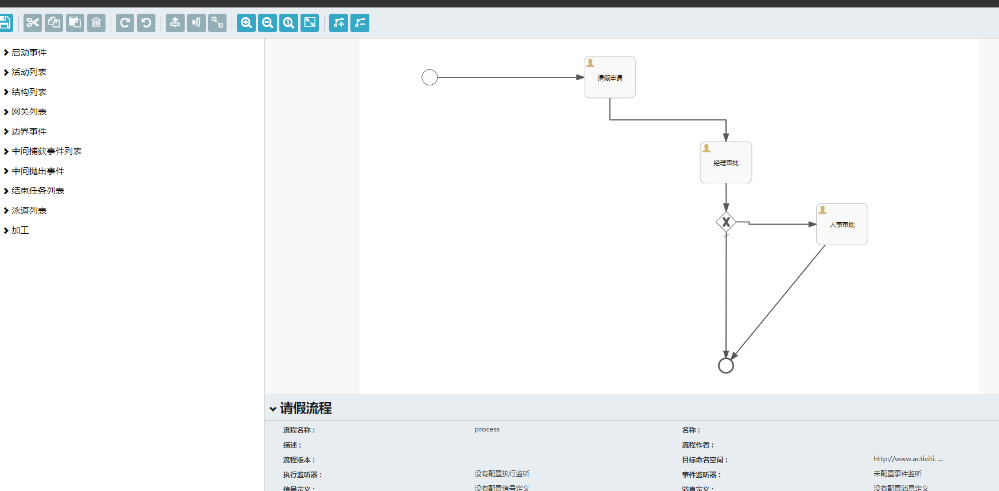   

> 步骤二： 流程设计完成之后即可调用activiti提供的api发布流程  
> 不熟悉API请参考离线文档，文档链接：https://pan.baidu.com/s/1qzK6_c4JGFiM0vgGcVn1Pw 提取码：4qts。

> 步骤三： 流程发布之后即可创建流程实例，如： 小明想提交请假单，则进入平台填写请假单，点击保存时候会根据发布的流程
> 创建流程实例，流程实例会携带一个叫做businessKey的参数，此参数用于关联业务单据与流程数据。
> 部分流程控制代码demo如下，还有很多其他接口，请自行查阅文档或博客

```java

/**
 * 发布流程
 */
@RestController
@RequestMapping("process")
public class ProcessController implements RestServiceController<Deployment, String> {
    @Autowired
    RepositoryService repositoryService;

    @Autowired
    RuntimeService runtimeService;

    @Autowired
    TaskService taskService;


    @Autowired
    private HistoryService historyService;

    @Autowired
    private ProcessEngineConfiguration processEngineConfiguration;

    @Override
    public Object getOne(@PathVariable("id") String id) {
        Deployment deployment = repositoryService.createDeploymentQuery().deploymentId(id).singleResult();
        return ToWeb.buildResult().setObjData(new DeploymentResponse(deployment));
    }

    @Override
    public Object getList(@RequestParam(value = "rowSize", defaultValue = "1000", required = false) Integer rowSize, @RequestParam(value = "page", defaultValue = "1", required = false) Integer page) {
        List<Task> tasks = taskService.createTaskQuery()
                .listPage(rowSize * (page - 1), rowSize);
        long count = taskService.createTaskQuery().count();
        List<TaskResponse> list = new ArrayList<>();

//        Set<String> taskIds = list.stream().map( TaskResponse::getId).collect(Collectors.toSet());

//        List<Deployment> deployments = repositoryService.createDeploymentQuery().list();

        for(Task task: tasks){
            list.add(TaskResponse.builder()
                    .assignee(task.getAssignee())
                    .deploymentTime(task.getCreateTime())
                    .id(task.getId())
                    .name(task.getName())
                    .build());
        }

        return ToWeb.buildResult().setRows(
                ToWeb.Rows.buildRows()
                        .setRowSize(rowSize)
                        .setTotalPages((int) (count/rowSize+1))
                        .setTotalRows(count)
                        .setList(list)
                        .setCurrent(page)
        );
    }

    @PostMapping("executions")
    public Object getExecutions(@RequestParam(value = "rowSize", defaultValue = "1000", required = false) Integer rowSize, @RequestParam(value = "page", defaultValue = "1", required = false) Integer page) {
        List<ProcessInstance> tasks = runtimeService.createProcessInstanceQuery()
                .listPage(rowSize * (page - 1), rowSize);
        long count = taskService.createTaskQuery().count();
        List<TaskResponse> list = new ArrayList<>();

        List<HistoricProcessInstance> historicProcessInstances = historyService.createHistoricProcessInstanceQuery().listPage(rowSize * (page - 1), rowSize);

//        Set<String> taskIds = list.stream().map( TaskResponse::getId).collect(Collectors.toSet());

//        List<Deployment> deployments = repositoryService.createDeploymentQuery().list();

        for(ProcessInstance task: tasks){
            list.add(TaskResponse.builder()
                    .id(task.getId())
                    .name(task.getName())
                    .build());
        }

        for(HistoricProcessInstance task: historicProcessInstances){
            list.add(TaskResponse.builder()
                    .id(task.getId())
                    .name(task.getName())
                    .build());
        }

        return ToWeb.buildResult().setRows(
                ToWeb.Rows.buildRows()
                        .setRowSize(rowSize)
                        .setTotalPages((int) (count/rowSize+1))
                        .setTotalRows(count)
                        .setList(list)
                        .setCurrent(page)
        );
    }


    @Override
    public Object deleteOne(@PathVariable("id") String id) {
        repositoryService.deleteDeployment(id);
        return ToWeb.buildResult().refresh();
    }

    @PostMapping("{id}/right")
    public Object right(@PathVariable("id") String id) {

        //使用正确的审批人执行任务

        String rightUser = "admin";


        Task task = taskService.createTaskQuery().taskId(id).taskAssignee(rightUser).singleResult();

        Map param = new HashMap();
        param.put("days",3);
        if (task != null)
            taskService.complete(task.getId(),param);
        else
            throw new IllegalArgumentException("该用户不存在此任务");
        return ToWeb.buildResult().refresh();
    }

    @PostMapping("{id}/fault")
    public Object fault(@PathVariable("id") String id) {
        //使用错误的审批人执行任务

        String faultUser = "00";

        Task task = taskService.createTaskQuery().taskId(id).taskAssignee(faultUser).singleResult();


        if (task != null)
            taskService.complete(task.getId());
        else
            throw new IllegalArgumentException("该用户不存在此任务");
        return ToWeb.buildResult().refresh();
    }

    @GetMapping(value = "{id}/progress",produces = MediaType.IMAGE_JPEG_VALUE)
    @ResponseBody
    public byte[]  progress(@PathVariable("id") String id, HttpServletResponse response) throws IOException {
//        Task task = taskService.createTaskQuery().taskId(id).singleResult();

        //根据任务id获取流程实例id
//        ProcessInstance processInstance = runtimeService.createProcessInstanceQuery().processInstanceId(task.getProcessInstanceId()).singleResult();

        //获取历史流程实例
        HistoricProcessInstance processInstance =  historyService.createHistoricProcessInstanceQuery().processInstanceId(id).singleResult();

        //获取流程图
        BpmnModel bpmnModel = repositoryService.getBpmnModel(processInstance.getProcessDefinitionId());

        ProcessDiagramGenerator diagramGenerator = processEngineConfiguration.getProcessDiagramGenerator();
        ProcessDefinitionEntity definitionEntity = (ProcessDefinitionEntity)repositoryService.getProcessDefinition(processInstance.getProcessDefinitionId());

        List<HistoricActivityInstance> highLightedActivitList =  historyService.createHistoricActivityInstanceQuery().processInstanceId(id).list();
        //高亮环节id集合
        List<String> highLightedActivitis = new ArrayList<String>();

        //高亮线路id集合
        List<String> highLightedFlows = ActivityDemoServiceImpl.getHighLightedFlows(definitionEntity,highLightedActivitList);

        for(HistoricActivityInstance tempActivity : highLightedActivitList){
            String activityId = tempActivity.getActivityId();
            highLightedActivitis.add(activityId);
        }
        //配置字体
        InputStream is = diagramGenerator.generateDiagram(bpmnModel, "png", highLightedActivitis, highLightedFlows,"宋体","微软雅黑","黑体",null,2.0);

        byte[] bytes = new byte[is.available()];
        is.read(bytes, 0, is.available());
        return bytes;

    }
}
```

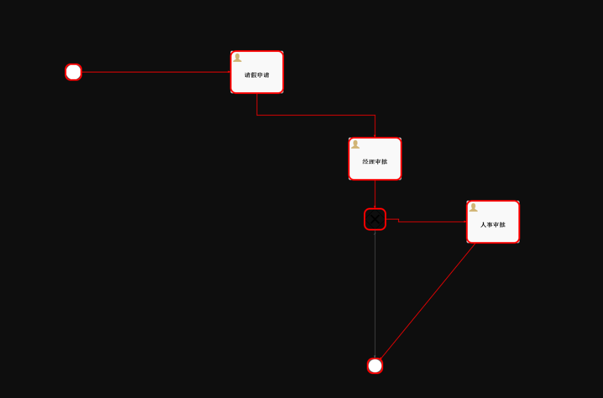   

?> 使用流程管理平台之后，我们不在需要在代码中硬编码流程走向判断条件，不在担心流程节点单据的变更与升级，能够实现高可靠的自动化流程管理。
使用此平台我们只需要自己设计各个节点上的表单，流程走向完全由BPM引擎来管理。

## 大数据API开发

!> 敬请期待...

## 网关路由配置
?> gateway为我们提供了一系列内置路由规则，当然我们也可以自定义规则，实现方法请自行百度或博客搜索。

> 步骤一： 修改gateway网关模块下的配置文件,下面列举了一个例子  
> 规则： 当localhost:8090/cloud-content被访问时，如果时间在2019-04-29至2090-05-01之间则会被转发到nacos的cloud-content服务上

```yaml
spring:
  cloud:
    #网关配置
    gateway:
      discovery:
        locator:
          #开启路由默认规则
          enabled: true
        #配置路由规则
      routes:
        - id: cloud-content
          uri: lb://cloud-content
          predicates:
            - Between=2019-04-29T00:00:00+08:00[Asia/Shanghai], 2090-05-01T00:00:00+08:00[Asia/Shanghai]
```

## 限流降级配置
?> 限流降级配置存在两种解决方案，硬编码方式/控制台配置

> 控制台配置  
> 步骤一：进入http//127.0.0.1:8080配置熔断降级规则，操作方法请自行百度搜索

## 分布式事务配置
> 步骤一：在需要使用全局事务的Service实现类方法上增加@GlobalTransactional注解，并确保业务库中已经添加了`undo_log`表

> 步骤二：在中间件`seata-server-1.0.0\seata\conf\nacos-config.txt`中添加需要使用到分布式事务的服务名称即可

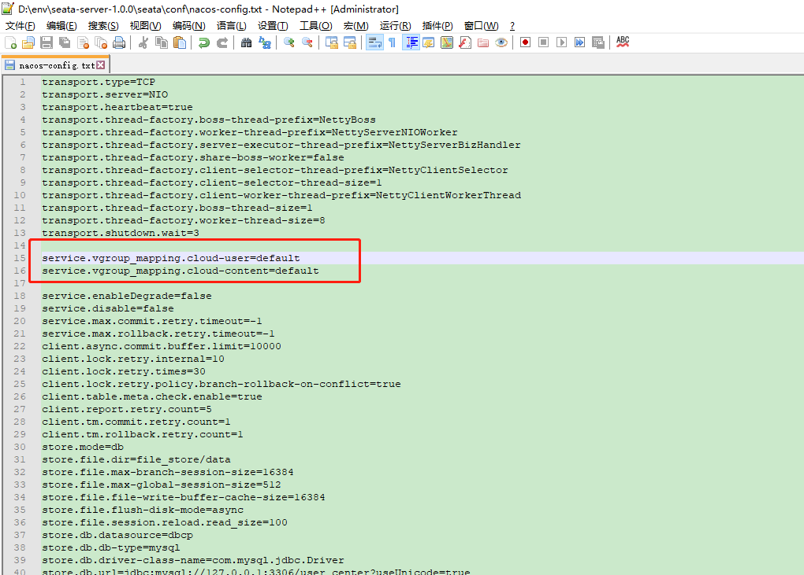   

## 多租户配置
> 步骤一：在yml中配置数据源连接，以下样例配置为通用连接池参数以及user、auth_sso两个租户数据库的配置
```yaml
spring:
  #数据源配置
  datasource:
    dynamic:
      #全局连接池配置
      druid:
        initialSize: 5
        minIdle: 5
        maxActive: 20
        maxWait: 60000
        timeBetweenEvictionRunsMillis: 60000
        minEvictableIdleTimeMillis: 300000
        validationQuery: SELECT 1
        testWhileIdle: true
        testOnBorrow: true
        testOnReturn: false
        poolPreparedStatements: true
        maxPoolPreparedStatementPerConnectionSize: 20
        filters: stat,wall
        connectionProperties: druid.stat.mergeSql=true;druid.stat.slowSqlMillis=5000
        stat-view-servlet:
          allow: 127.0.0.1
      datasource:
        user:
          username: root
          #密码：123456
          password: ENC(Y3ycHCcZGa+N+OK+qXTWA0gJ1L1N+FYrswTgRQEegdKVTefiujYxjlytR6zOuV5Y3AifL/P10yWshYKQaqpkkQ==)
          driver-class-name: com.mysql.cj.jdbc.Driver
          url: jdbc:mysql://127.0.0.1:3306/user_center?useUnicode=true&characterEncoding=utf-8&allowMultiQueries=true&useSSL=false&serverTimezone=Asia/Shanghai
        auth_sso:
          username: root
          #密码：123456
          password: ENC(Y3ycHCcZGa+N+OK+qXTWA0gJ1L1N+FYrswTgRQEegdKVTefiujYxjlytR6zOuV5Y3AifL/P10yWshYKQaqpkkQ==)
          driver-class-name: com.mysql.cj.jdbc.Driver
          url: jdbc:mysql://127.0.0.1:3306/user_center?useUnicode=true&characterEncoding=utf-8&allowMultiQueries=true&useSSL=false&serverTimezone=Asia/Shanghai
```
> 步骤二：静态数据源配置 在Service实现层类名或方法名上硬编码@DS("租户名称")即可连接此租户，方法上注解优于类上注解

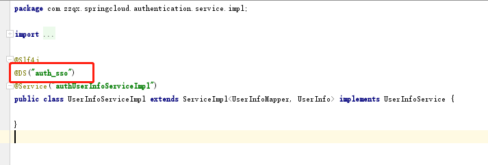   

>步骤三：动态数据源配置 在Service实现层类名或方法名上硬编码@DS("#thread.key")即可连接线程中获取到的key对应的value（租户名称）的租户，核心代码如下

```java
package com.zzqx.springcloud.processcenter.datasource;//package com.zzqx.springcloud.authentication.datasource;

import com.baomidou.dynamic.datasource.processor.DsProcessor;
import com.zzqx.springcloud.common.datasource.LocalThread;
import org.aopalliance.intercept.MethodInvocation;

/**
 * 线程中取租户名称
 */
public class DsCommonProcessor extends DsProcessor {

    private static final String HEADER_PREFIX = "#thread";


    @Override
    public boolean matches(String key) {

        return key.startsWith(HEADER_PREFIX);
    }

    @Override
    public String doDetermineDatasource(MethodInvocation invocation, String key) {
        Object obj = LocalThread.getLocalThreadValue(key.substring(8));
        return obj == null ? "" :obj.toString();
    }
}
```

## 单点登录服务配置
> 步骤一：在需要使用CAS单点登录的模块配置中增加SSO客户端名称、服务端地址、客户端地址
```yaml
#cas配置
cas:
  client-name: cloud-system
  server:
    url: http://127.0.0.1:8050/cas
  project:
    url: http://127.0.0.1:8081
```

> 步骤二： 在`ShiroConfig.loadShiroFilterChain`方法中配置需要使用cas过滤器`securityFilter`拦截的路径即可 

## easycode代码生成
> 步骤一：进入IDEA Database透视图，连接需要生成代码的数据库

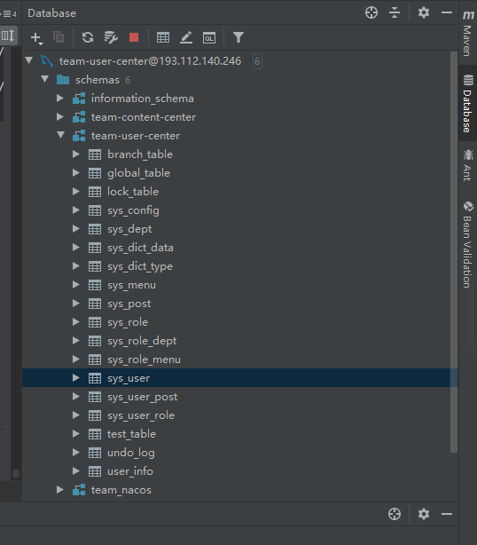   

> 步骤二：选择需要生成的表，选择config table，设置前后端生成参数

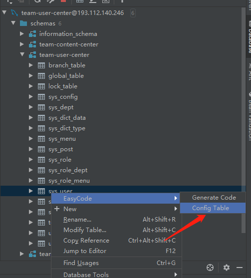
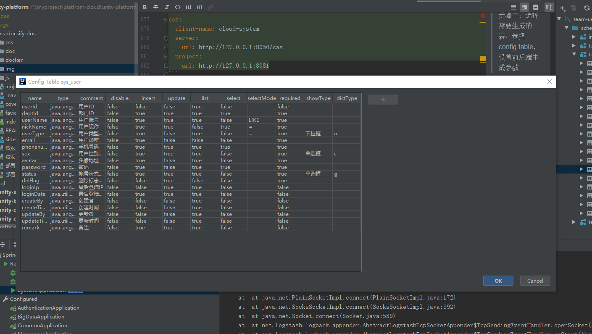

> 步骤三：选择需要动态生成的文件与包路径
>
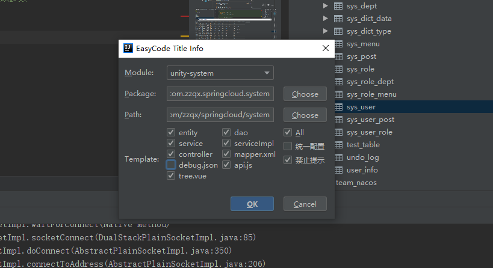    

?> config table参数详解如下：

| 属性 | 用途 |
| :-----| :---- |
| name | 字段名 |
| type | 字段类型 |
| comment | 字段注释 |
| disable | 冗余，未作判断 |
| insert | 是否新增 |
| update | 是否修改 |
| list | 是否在列表显示 |
| select | 是否作为查询条件 |
| selectMode | 后端查询方式 |
| required | 是否必填 |
| showType | 字段显示方式 |
| dictType | 业务字典选择 |

## mqtt消息推送

**概要**

> mqtt是基于C/S（client/Server）的架构，支持mqtt消息推送的协议。
>

**spring 基于netty实现内嵌mqtt server**

> 基于netty实现基于tcp请求的mqtt协议mqtt server端服务，以及基于websocket协议转发到mqtt协议的方式。该部分的具体实现请参考曾成的代码。
>
> 同时，mqtt server 组件可以基于服务器进行外置的部署，提供mqtt消息推送的服务，有现成的组件可以进行使用。

**使用messenger模块接口消息推送**

> 当server端启动之后，客户端可以直接连接mqtt，进行基于topic发布-订阅的模式进行消息推送。支持点对点、广播形式的消息推送。
>

点对点形式推送消息：


广播形式推送消息：

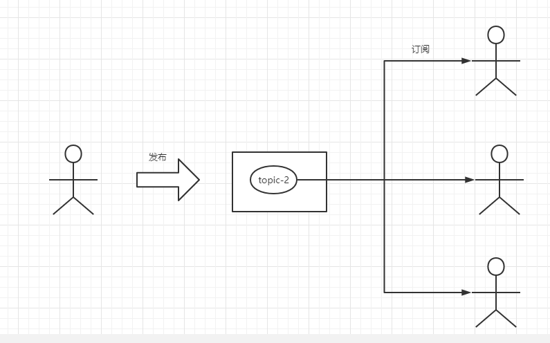

**后端通过启动messenger服务，创建mqtt-server端**
具体步骤：

1.增加mqtt相关的pom依赖。

```html
 <!-- mqtt相关依赖 -->
        <dependency>
            <groupId>org.springframework.integration</groupId>
            <artifactId>spring-integration-mqtt</artifactId>
            <version>5.2.5.RELEASE</version>
        </dependency>
        <dependency>
            <groupId>io.netty</groupId>
            <artifactId>netty-all</artifactId>
            <version>4.1.33.Final</version>
        </dependency>
        <dependency>
            <groupId>com.h2database</groupId>
            <artifactId>h2-mvstore</artifactId>
            <version>1.4.199</version>
        </dependency>
        <dependency>
            <groupId>io.dropwizard.metrics</groupId>
            <artifactId>metrics-core</artifactId>
            <version>4.0.5</version>
        </dependency>
        <dependency>
            <groupId>io.dropwizard.metrics</groupId>
            <artifactId>metrics-jvm</artifactId>
            <version>4.0.5</version>
        </dependency>
        <dependency>
            <groupId>com.librato.metrics</groupId>
            <artifactId>metrics-librato</artifactId>
            <version>5.1.4</version>
        </dependency>
        <dependency>
            <groupId>com.librato.metrics</groupId>
            <artifactId>librato-java</artifactId>
            <version>2.1.3</version>
        </dependency>
        <dependency>
            <groupId>com.bugsnag</groupId>
            <artifactId>bugsnag</artifactId>
            <version>3.4.5</version>
        </dependency>
        <dependency>
            <groupId>commons-codec</groupId>
            <artifactId>commons-codec</artifactId>
            <version>1.11</version>
        </dependency>
        <dependency>
            <groupId>com.alibaba</groupId>
            <artifactId>fastjson</artifactId>
            <version>1.2.56</version>
        </dependency>
```

2. 接口
```java
    /**
     * 点对点发送通知.
     *
     * @param notify 通知发送参数
     * @return 唯一消息ID
     */
    String send(P2PNotify notify);
```

3. mqtt 点对点推送接口地址。 

```http
http://localhost:8091/message/p2p/notify/send
```

4. 接口post请求体参数说明。

```http request
{
	"channels":["PUSH"], //推送消息类型 PUSH 为mqtt消息推送，可以多选
	"messageBodys":"你好呀", //推送消息内容
	"messageCover":"消息封面", //消息封面
	"messageIntro":"消息简介", //消息简介
	"messageTitle":"消息标题",  //消息标题
	"serviceNo":"MQTT_00001", //消息服务编号 必填
	"userId":"1" //用户id，唯一识别码 将作为topic
}
```

**前端基于socket接入**

参照paho mqtt官网**[ paho.mqtt.javascript](https://github.com/eclipse/paho.mqtt.javascript)**

```javascript
// Create a client instance
//创建一个客户端实例 客户端id
var client = new Paho.MQTT.Client(location.hostname, Number(location.port), "clientId");

// set callback handlers
//创建回调处理
client.onConnectionLost = onConnectionLost;
client.onMessageArrived = onMessageArrived;

// connect the client
//连接客户端,用户名，密码
client.connect({
                onSuccess: onConnect,
                cleanSession: true,
				userName: 'admin', 
				password: '1111',
                useSSL: false,
                keepAliveInterval: 60
});


// called when the client connects
//当客户的连接时回调
function onConnect() {
  // Once a connection has been made, make a subscription and send a message.
  console.log("onConnect");
  client.subscribe("World");
  message = new Paho.MQTT.Message("Hello");
  message.destinationName = "World";
  client.send(message);
}

// called when the client loses its connection
//当连接端口时回调
function onConnectionLost(responseObject) {
  if (responseObject.errorCode !== 0) {
    console.log("onConnectionLost:"+responseObject.errorMessage);
  }
}

// called when a message arrives
//当消息抵达时回调
function onMessageArrived(message) {
  console.log("onMessageArrived:"+message.payloadString);
}
```

注意：由于mqtt默认是按照socket进行通信，客户端连接会产生握手失败，所以服务端要开启websoket功能，同时发送消息要通过websocket的接口进行推送，server端自行处理转发成mqtt消息推送。

```http request
paho-mqtt.js:1052 WebSocket connection to 'ws://127.0.0.1:1883/' failed: Connection closed before receiving a handshake response
```


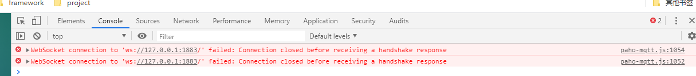

## 个推消息推送
1. 增加app个推相关的pom依赖。
```html
        <dependency>
            <groupId>com.gexin.platform</groupId>
            <artifactId>gexin-rp-sdk-base</artifactId>
            <version>4.0.0.14</version>
        </dependency>
        <dependency>
            <groupId>com.gexin.platform</groupId>
            <artifactId>gexin-rp-sdk-template</artifactId>
            <version>4.0.0.8</version>
        </dependency>
        <dependency>
            <groupId>com.gexin.platform</groupId>
            <artifactId>gexin-rp-fastjson</artifactId>
            <version>1.0.0.0</version>
        </dependency>
        <dependency>
            <groupId>com.gexin.platform</groupId>
            <artifactId>gexin-rp-sdk-http</artifactId>
            <version>4.1.0.3</version>
        </dependency>
        <!-- https://mvnrepository.com/artifact/com.google.protobuf/protobuf-java -->
        <dependency>
            <groupId>com.google.protobuf</groupId>
            <artifactId>protobuf-java</artifactId>
            <version>2.5.0</version>
        </dependency>
```

2. 配置与接口

?>相关配置： appId、appKey、appSecret、masterSecret均由前端提供。
```java
public class GEPUSHConfigure {

    public  String appId = "***************";
    //预先分配的第三方应用对应的Key，是您的应用与SDK通信的标识之一。
    public  String appKey = "***************";
    //个推服务端API鉴权码，用于验证调用方合法性。在调用个推服务端API时需要提供。（请妥善保管，避免通道被盗用）
    public  String appSecret="***************";
    public  String masterSecret = "***************";
}
```
接口
```java
    /**
     * 点对点发送通知.
     *
     * @param notify 通知发送参数
     * @return 唯一消息ID
     */
    String send(P2PNotify notify);
```

3. 接口接口地址
```http
http://localhost:8091/message/p2p/notify/send
```

4. 接口post请求体参数说明。
```http request
{
	"channels":["GEPUSH"],
	"messageCover":"消息封面",
	"messageIntro":"消息简介",
	"messageTitle":"欢迎使用", 
	"serviceNo":"GEPUSH_00001",
	"params":{"1":"你好"},
	"userId":"1"
}
```

## 短信消息推送
1. 增加腾讯短信推送相关的pom依赖。
```html
        <!--腾讯短信-->
        <dependency>
            <groupId>com.github.qcloudsms</groupId>
            <artifactId>qcloudsms</artifactId>
            <version>1.0.6</version>
        </dependency>
```

2. 配置与接口

?>相关配置： appId 和 appKey均在腾讯云短信管理中获取。
```java
public class TencentCloudConfigure {

    private Integer appId  = 1400140737;
    private String  appKey = "d331929a0255f2a5e0960c6cf7a94d81";
}
```
接口：
```java
    /**
     * 点对点发送通知.
     *
     * @param notify 通知发送参数
     * @return 唯一消息ID
     */
    String send(P2PNotify notify);
```

3. 接口地址
```http
http://localhost:8091/message/p2p/notify/send
```

4. 接口post请求体参数说明。
```html
{
	"channels":["SMS"],
	"messageCover":"消息封面",
	"messageIntro":"消息简介",
	"messageTitle":"欢迎使用", 
	"serviceNo":"SMS_00001",
	"params":{"1":"充值","2":"2020-5-28"},
	"userId":"1"
}
```

## 邮箱消息推送
1. 增加相关依赖
```mxml
        <!--邮箱依赖-->
        <dependency>
            <groupId>org.springframework.boot</groupId>
            <artifactId>spring-boot-starter-mail</artifactId>
        </dependency>
```
2. 配置与接口
配置在yaml配置文件中：
```yaml
spring:
  mail:
    host: smtp.qq.com
    username: 2510549935@qq.com
    password: fdozbsjhlapndjcd
    port: 25
    properties:
      mail:
        smtp:
          auth: true
          starttls:
            enable: true
            required: true
          socketFactory:
            class: javax.net.ssl.SSLSocketFactory
```

接口：
```java
    /**
     * 点对点发送通知.
     *
     * @param notify 通知发送参数
     * @return 唯一消息ID
     */
    String send(P2PNotify notify);
```

3. 接口地址

```http request
http://localhost:8091/message/p2p/notify/send
```

4. 接口post请求体参数说明
```html
{
	"channels":["MAIL"],
	"messageCover":"消息封面",
	"messageIntro":"消息简介",
	"messageTitle":"欢迎使用", 
	"serviceNo":"MAIL_00001", //业务编号
	"params":{"mail":"huzx666@163.com"}, //邮箱地址
	"messageBodys":"你好，测试邮箱发送", //消息内容
	"userId":"1" //用户id
}
```
>消息推送参数统一说明

 | 字段 | 含义 |
 | :---- | :--- |
 | channels | 推送方式|
 | messageCover | 消息封面 |
 | messageIntro | 消息简介 |
 | messageTitle | 消息标题 |
 | serviceNo | 业务编号,后台数据库定义 |
 | params | 自定义参数 |
 | messageBodys | 消息内容 |
 | userId | 用户编号 |
 
## 分布式定时调度

 **概要**
 
> 本次定时调度使用XXL-JOB,XXL-JOB是一个轻量级分布式任务调度框架，其核心设计目标是开发迅速、学习简单、轻量级、易扩展。
>

 **工作过程**
> 在xxl-job admin调度中心先触发任务，然后通过执行器注册的netty通信server port发送执行命令（无论是java定时任务，还是shell脚本任务），
> 发送的执行命令其实就是告诉9999端口去8081的endpoint执行指定JobHandler的execute方法（具体是使用指定JobHandler的名称查找jvm中@JobHandler容器获取到类的信息后利用反射机制去执行）


**架构图**
 

**快速开发**
1. 启动task-admin,进入调度中心
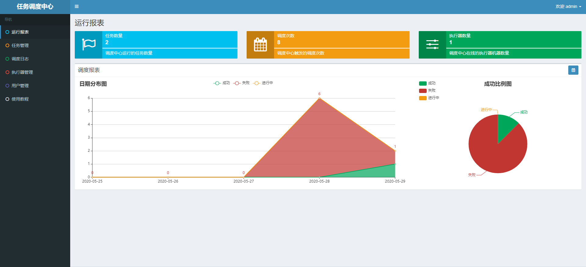
2. 配置执行器
 - 在所需定时任务模块添加依赖
 ```mxml
 <!-- xxl-job-core -->
        <dependency>
            <groupId>com.zzqx.cloud</groupId>
            <artifactId>task-core</artifactId>
            <version>${project.parent.version}</version>
        </dependency>
 ```
 - 在配置文件中进行配置
 ```yaml
 #   任务调度配置
    xxl:
      job:
    #    执行器"AppName"和地址信息配置：AppName执行器心跳注册分组依据
        executor:
          address:
          logpath: /data/applogs/xxl-job/jobhandler
          appname: xxl-job-executor-sample
          port: 9999
          logretentiondays: 30
          ip:
        admin:
    #      调度中心部署跟地址
          addresses: http://119.96.230.241:8557/
    #      执行器通讯TOKEN，非空时启用
        accessToken:
  ```
 
 - 添加配置类
 ```java
public class XxlJobConfig {
    private Logger logger = LoggerFactory.getLogger(XxlJobConfig.class);

    @Value("${xxl.job.admin.addresses}")
    private String adminAddresses;

    @Value("${xxl.job.accessToken}")
    private String accessToken;

    @Value("${xxl.job.executor.appname}")
    private String appname;

    @Value("${xxl.job.executor.address}")
    private String address;

    @Value("${xxl.job.executor.ip}")
    private String ip;

    @Value("${xxl.job.executor.port}")
    private int port;

    @Value("${xxl.job.executor.logpath}")
    private String logPath;

    @Value("${xxl.job.executor.logretentiondays}")
    private int logRetentionDays;
    @Bean
    public XxlJobSpringExecutor xxlJobExecutor() {
        logger.info(">>>>>>>>>>> xxl-job config init.");
        XxlJobSpringExecutor xxlJobSpringExecutor = new XxlJobSpringExecutor();
        xxlJobSpringExecutor.setAdminAddresses(adminAddresses);
        xxlJobSpringExecutor.setAppname(appname);
        xxlJobSpringExecutor.setAddress(address);
        xxlJobSpringExecutor.setIp(ip);
        xxlJobSpringExecutor.setPort(port);
        xxlJobSpringExecutor.setAccessToken(accessToken);
        xxlJobSpringExecutor.setLogPath(logPath);
        xxlJobSpringExecutor.setLogRetentionDays(logRetentionDays);

        return xxlJobSpringExecutor;
    }
}
 ```
 - 在调度中心建立执行器
 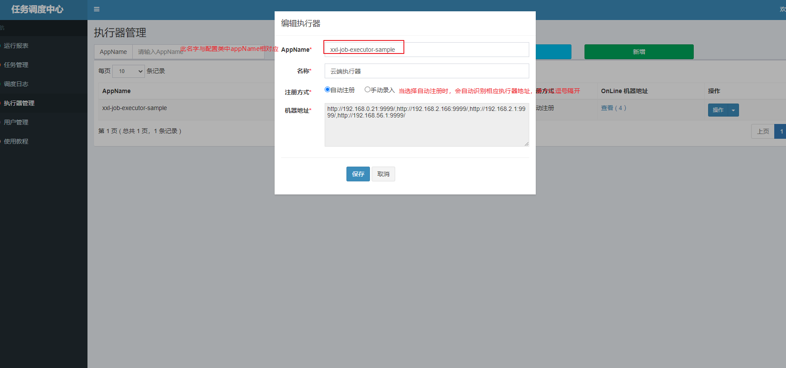
3. 开发定时任务(javabean模式)
```java
/**
 * XxlJob开发示例（Bean模式）
 * 开发步骤：
 * 1、在Spring Bean实例中，开发Job方法，方式格式要求为 "public ReturnT<String> execute(String param)"
 * 2、为Job方法添加注解 "@XxlJob(value="自定义jobhandler名称", init = "JobHandler初始化方法", destroy = "JobHandler销毁方法")"，注解value值对应的是调度中心新建任务的JobHandler属性的值。
 * 3、执行日志：需要通过 "XxlJobLogger.log" 打印执行日志；
 *
 */
@Component
@Slf4j
public class SampleXxlJob {
    private static Logger logger = LoggerFactory.getLogger(SampleXxlJob.class);

    @Autowired
    private UserService userService;

    @Autowired
    SeataService seataService;

    /**
     * 1、简单任务示例（Bean模式）
     */
    @XxlJob("demoJobHandler")
    public ReturnT<String> demoJobHandler(String param) throws Exception {
        XxlJobLogger.log("用户查询定时任务开始");
        seataService.noticeSaveSeata();
        XxlJobLogger.log("用户查询定时任务结束"+userService.selectUserById(100l));
        return ReturnT.SUCCESS;
    }
}
```
4. 在调度中心新建定时任务
 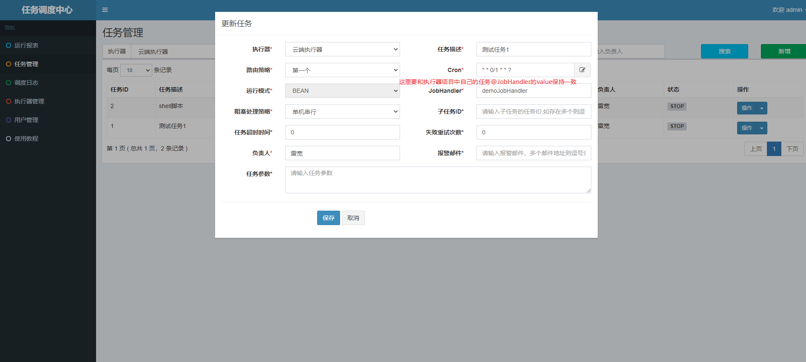

5. 触发执行
> 请点击任务右侧 “执行” 按钮，可手动触发一次任务执行（通常情况下，通过配置Cron表达式进行任务调度触发）。

6. 查看日志
> 请点击任务右侧 “日志” 按钮，可前往任务日志界面查看任务日志。
> 在任务日志界面中，可查看该任务的历史调度记录以及每一次调度的任务调度信息、执行参数和执行信息。运行中的任务点击右侧的“执行日志”按钮，可进入日志控制台查看实时执行日志。
>
 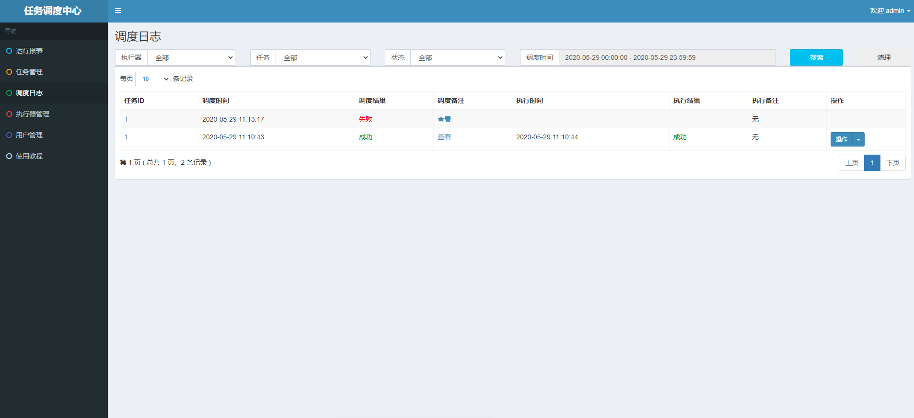
>在日志控制台，可以Rolling方式实时查看任务在执行器一侧运行输出的日志信息，实时监控任务进度；
>
 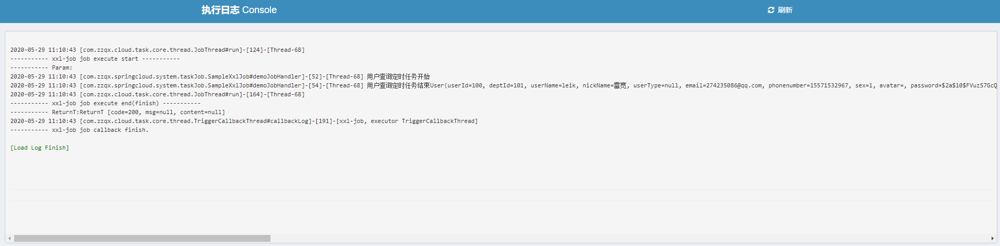


## 搜索引擎solr
>加入solr的pom依赖。
```mxml
        <!--solr依赖-->
        <dependency>
            <groupId>org.springframework.boot</groupId>
            <artifactId>spring-boot-starter-data-solr</artifactId>
        </dependency>
```
> 在yml配置文件中增加配置
```yaml
spring: 
  data:
    solr:
      url: http://@119.96.230.241:8983/solr
      username: dev
      password: 123456
```
> spring data solr内置的起步依赖，只支持单core。
> 因为分布式环境下涉及到多core（类似于多库），所以增加配置类SearchAutoConfig.
```java
@Configuration
public class SearchAutoConfig {
    @Value("${spring.data.solr.url}")
    private String url ;
    @Value("${spring.data.solr.username}")
    private String username ;
    @Value("${spring.data.solr.password}")
    private String password ;


    /**
     * spring 内置的 SolrTemplate 暂时保留
     * @param solrClient
     * @return
     */
    @Bean
    @ConditionalOnMissingBean(SolrTemplate.class)
    public SolrTemplate solrTemplate(SolrClient solrClient) {
        return new SolrTemplate(solrClient);
    }

    /**
     * 创建solrclient客户端
     * @return
     */
    @Bean
    public SolrClient solrClient(){
        Credentials credentials = new UsernamePasswordCredentials(username, password);
        CredentialsProvider provider    = new BasicCredentialsProvider();
        provider.setCredentials(AuthScope.ANY, credentials);
        HttpClient client = HttpClientBuilder
                .create()
                .setDefaultCredentialsProvider(provider)
                .addInterceptorFirst((HttpRequestInterceptor) (r, c) -> {
                    AuthState state  = (AuthState) c.getAttribute(HttpClientContext.TARGET_AUTH_STATE);
                    BasicScheme scheme = new BasicScheme();
                    state.update(scheme, credentials);
                })
                .build();
        SolrClient solrClient = new HttpSolrClient.Builder(url)
                .withHttpClient(client)
                .withConnectionTimeout((int) Duration.ofSeconds(5).toMillis())
                .withSocketTimeout((int) Duration.ofSeconds(15).toMillis())
                .build();
        return solrClient;
    }
}
```
> 在启动类上取消solr的自动装配
```java
@SpringBootApplication(scanBasePackages = {"com.zzqx.springcloud"},exclude = {DruidDataSourceAutoConfigure.class,SolrAutoConfiguration.class})
```
> solr的简单增删改查api使用demo。
solr的增删改查在test模块中有相应的测试用例

>首先要增加实体类，通过@Filed注解进行字段映射，与solr查询的数据字段映射。
```java
@SolrDocument(collection = "kfbk1")
@Data
public  class CeCustomerEncyclopediaDTO implements Serializable {

    private static final long serialVersionUID = 1434113824324684550L;
    /** 编号 */
    @Field("id")
    private String id;

    /** 客服百科分类id */
    @Field("ceeId")
    private Integer ceeId;

    /** 标题 */
    @Field("title")
    private String title;

    /** 简介 */
    @Field("brief")
    private String brief;

    /** 浏览量 */
    @Field("viewNum")
    private Long viewNum;

    /** 内容 */
    @Field("content")
    private String content;

    /** 缩略内容 */
    @Field("condenseContent")
    private String condenseContent;

    /** 发布状态(1 发布 0 停用)*/
    @Field("isRelease")
    private Object isRelease;

}
```

新增

```java
    public void add(CeCustomerEncyclopediaDTO ceCustomerEncyclopediaDTO) throws IOException, SolrServerException {
            solrClient.addBean("kfbk1",ceCustomerEncyclopediaDTO);
            UpdateResponse response = solrClient.commit("kfbk1");
    }
```
修改

```java
    @Override
    public void update(CeCustomerEncyclopediaDTO ceCustomerEncyclopediaDTO) {
        solrTemplate.saveBean("kfbk1", ceCustomerEncyclopediaDTO);
        solrTemplate.commit("kfbk1");
    }
```
删除

```java
   public void delete(String id) throws IOException, SolrServerException {
        solrClient.deleteById("kfbk1", id);
    }
```
根据id查询

```java
    @Override
    public CeCustomerEncyclopediaDTO selectById(String id) {
        SolrQuery query = new SolrQuery();
        String queryStr = "id:" + id;
        query.set("q", queryStr);
        try {
            QueryResponse resp = solrClient.query("kfbk1", query);
            List<CeCustomerEncyclopediaDTO> list = resp.getBeans(CeCustomerEncyclopediaDTO.class);
            return list.get(0);
        } catch (SolrServerException | IOException e) {
            e.printStackTrace();
        }

        return null;
    }
```

分页查询，且高亮显示
```java
 public PageInfo select(String content, int currentPage, int pageSize, Integer ceeId) throws IOException, SolrServerException {
        SolrQuery query = new SolrQuery();
        String queryStr = "(title:" + content + " || condenseContent:" + content + ") && isRelease:1";
        log.info("solr客服百科查询条件:{}", queryStr);
        query.set("q", queryStr);
        // 分页，0开始，每页5条，setStart设置的就是显示第几页
        query.setStart(currentPage - 1);
        query.setRows(pageSize);
        // 开启高亮
        query.setHighlight(true);
        // 添加高亮字段，多个字段之间逗号隔开比如: A,B,C
        query.addHighlightField("title,condenseContent");
        // 设置高亮字段的前缀
        query.setHighlightSimplePre("<span style='color: red'>");
        // 设置高亮字段的后缀
        query.setHighlightSimplePost("</span>");
        if (null != ceeId) {
            query.set("fq", "ceeId:" + ceeId);
        }
        // 分页，0开始，每页5条，setStart设置的就是显示第几页
        QueryResponse response = solrClient.query("kfbk1", query);
        List<CeCustomerEncyclopediaDTO> userList = response.getBeans(CeCustomerEncyclopediaDTO.class);

        Map<String, Map<String, List<String>>> highlighting = response.getHighlighting();
        userList.forEach(s -> {
            Map<String, List<String>> stringListMap = highlighting.get(s.getId());
            if (!stringListMap.isEmpty()) {
                List<String> list = stringListMap.get("title");
                if (CollectionUtils.isNotEmpty(list)) {
                    s.setTitle(list.stream().findFirst().get());
                }
                List<String> list1 = stringListMap.get("condenseContent");
                if (CollectionUtils.isNotEmpty(list1)) {
                    s.setContent(list1.stream().findFirst().get());
                } else {
                    s.setContent(s.getCondenseContent());
                }
                s.setCondenseContent(null);
            }
        });
        PageInfo page = new PageInfo<>();
        long numFound = response.getResults().getNumFound();
        page.setTotal((int) numFound);
        page.setPageNum(currentPage);
        page.setPageSize(pageSize);
        page.setList(userList);
        return page;
    }
```

