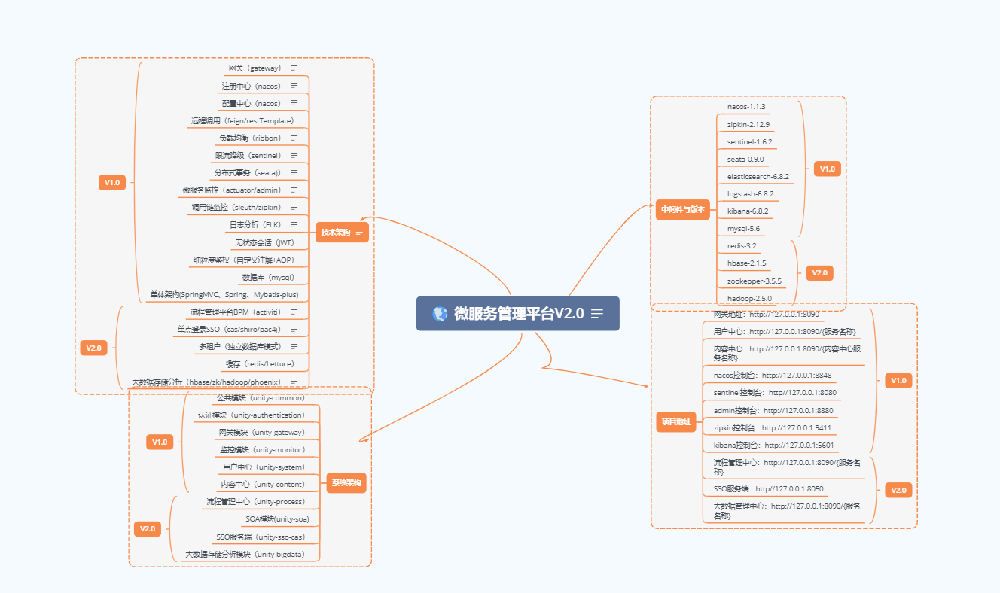
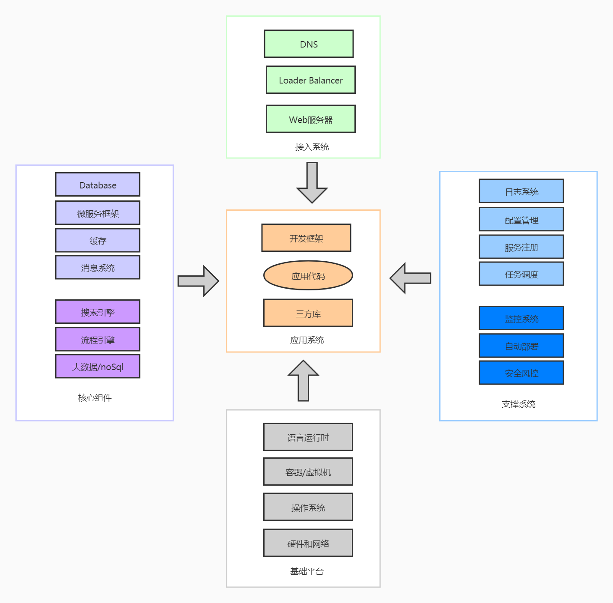
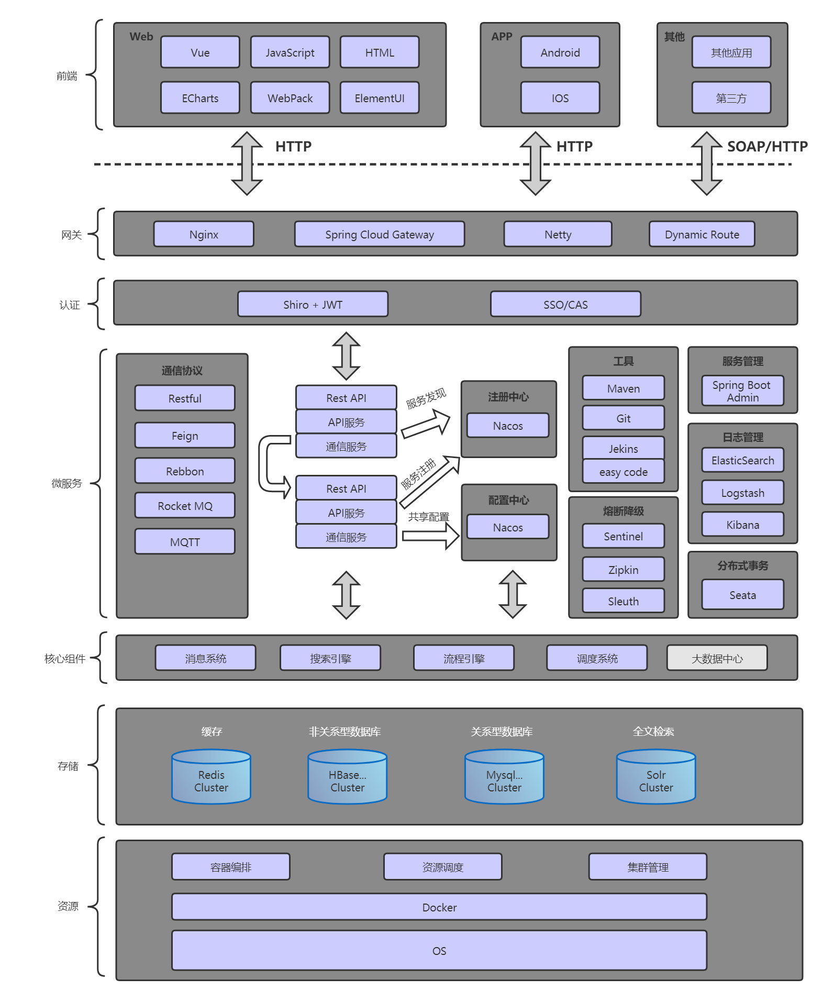
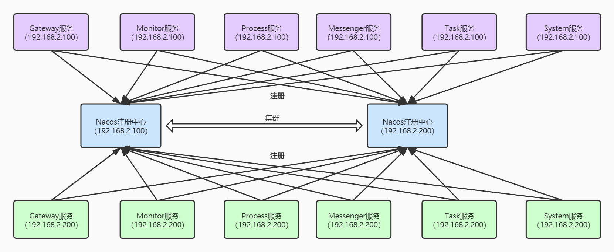
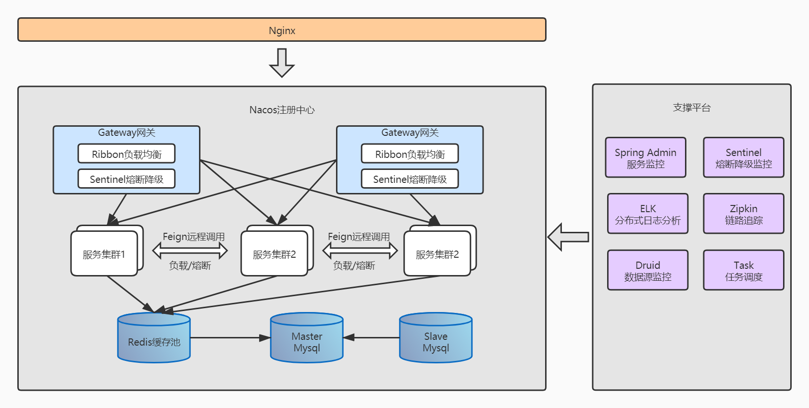
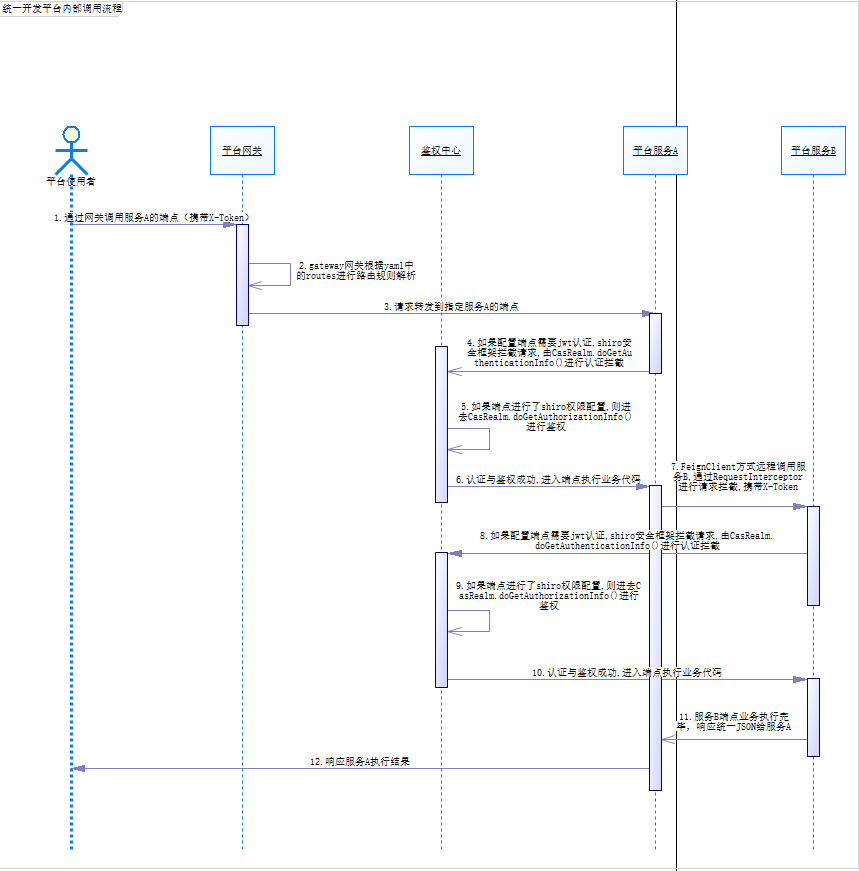

#  框架简介

#### 本节包含以下几部分内容。
1. [平台概述](#平台概述)
1. [平台组成](#平台组成)
1. [平台特性](#平台特性)
1. [平台架构](#平台架构)
1. [平台环境需求](#平台环境需求)
1. [平台安装介质](#平台安装介质)

## 平台概述
此平台是是分布式环境下的微服务应用平台，支持微服务应用（前端应用、后端服务）和传统SOA应用的建设。
平台是基于行业内最成熟主流的SpringCloud实现微服务的架构、整合了所有分布式系统常见的解决方案来解决
分布式环境存在的痛点。具有稳定、高效、扩展性强、体系完整、社区活跃等众多优势。 

## 平台组成  
<h4>通用模块--unity-common</h4> 
一些工具类,通用配置  

<h4>认证中心模块--unity-authentication</h4>

- 用户登录检查与用户权限检查的自定义注解（非单点登录）  
- 本地直接登录 使用shiro+jwt生成token认证授权（非单点登录）   
- SSO服务器 基于浏览器，shiro+cas+pac4j （单点登录）   
- 单点登录，属于方式一增强版，登录后由sso返回登录信息（非单点登录）  

<h4>通用接口层--unity-interface</h4>
远程调用公用接口层

<h4>网关服务--unity-gateway</h4>
客户端请求网关,gateway通过nacos服务发现转发到指定服务的指定端点

<h4>监控中心服务--unity-monitor</h4>
整合springboot-admin,实现对springboot-actuator的可视化

<h4>流程管理中心--unity-process</h4>
提供在线流程编辑,统一流程管理、流程干预等

<h4>统一认证服务端--unity-sso-cas</h4>
统一认证处理的服务端

<h4>SOA模块--unity-soa</h4>
针对WebService服务的两种发布调用方式

<h4>大数据存储分析模块--unity-bigdata</h4>
处理百万级数据库mysql无法高效处理的数据，
可以用来做日志存储，对象存储，海量监控信息存储分析

<h4>系统模块--unity-system</h4>
数据库包括一张用户表,四张seata分布式事务基础表

<h4>内容中心模块--unity-content</h4>
数据库包括一张通知表,四张seata分布式事务基础表

## 平台特性  
- 支持nacos注册中心、
- 支持nacos配置中心、
- 支持gateway网关路由、
- 支持feign/resttemplate远程调用、
- 支持ribbon负载均衡、
- 支持sentinel服务熔断降级、
- 支持seata无侵入分布式事务、
- 支持actuator/admin服务监控分析、
- 支持sleuth/zipkin服务调用链监控分析、
- 支持ELK分布式日志搜集分析、
- 提供Activiti BPM流程管理、
- 支持cas/shiro/pac4j单点登录、
- 支持多租户、
- 提供SOA模块对WebService发布调用、
- 提供大数据存储分析hbase/zk/hadoop/phoenix、
- 支持IDEA插件方式自动生成标准代码

## 平台架构

<h4>系统物理模型</h4>

 

<h4>技术架构模型</h4>

 

<h4>微服务高可用设计</h4>

 

<h4>布局分布图</h4>

 

<h4>平台接口调用内部时序图</h4>

 

## 平台环境需求
| 项目 | 说明 | 
| :-----| :---- |
| 操作系统 | 任意 | 
| 应用服务器 | 内置tomcat |
| Web服务器 | Nginx  |
| JDK | 1.8 |
| 数据库 | 任意  |
| 浏览器 | 任意  |

## 平台安装介质
- nacos-1.1.3-注册中心配置中心
- zipkin-2.12.9-调用链监控可视化界面，整合自spirng-cloud-sleuth
- elasticsearch-6.8.2-监控数据持久化服务端、日志收容、搜索引擎
- logstash-6.8.2-日志收发
- kibana-6.8.2-日志分析可视化处理
- sentinel-1.6.2-服务熔断降级
- seata-1.0.0-alibaba无侵入分布式事务框架，支持回滚
- mysql-5.6-百万级数据存储，关系型数据库
- redis-3.2-轻量级缓存服务器，非关系型数据库
- hbase-2.1.5-百亿级数据存储，非关系型数据库
- zookepper-3.5.5-hbase依赖
- hadoop-2.5.0-hbase依赖

> 中间件百度云下载地址：  
> 链接：https://pan.baidu.com/s/1oLdkpeOz8wbCn9fRhaataA   
> 提取码：mj4i   
> 弃用seata0.9.0,升级为1.0.0  
> 链接：https://pan.baidu.com/s/1bxmziCJcHUq0hte6Ehha5A   
> 提取码：9770  
