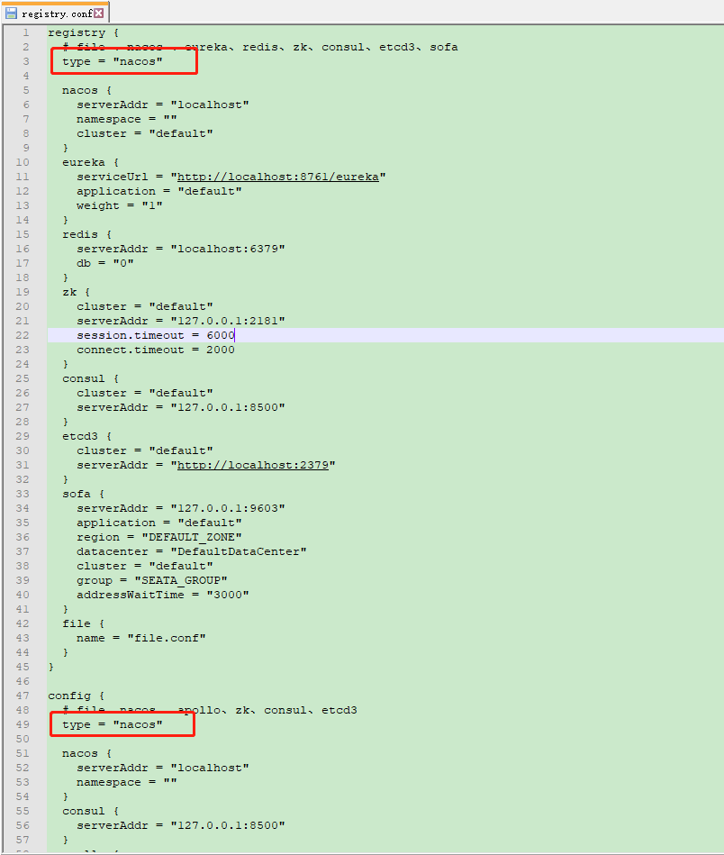

#  框架安装指南

#### 本节包含以下几部分内容。
- [安装前准备](#安装前准备)
- [数据库安装](#数据库安装)
- [代码生成器插件安装](#代码生成器插件安装)  
- [注册/配置中心组件安装](#注册/配置中心组件安装)
- [限流降级组件安装](#限流降级组件安装)
- [分布式事务组件安装](#分布式事务组件安装)
- [服务监控组件安装](#服务监控组件安装)
- [调用链组件安装](#调用链组件安装)
- [分布式日志中间件安装](#分布式日志中间件安装)
- [大数据中间件安装](#大数据中间件安装)
- [单点登录服务端安装](#单点登录服务端安装)

##  安装前准备
- 已安装 JDK 1.8.0_172 及以上版本，并且已经设置 JAVA_HOME 以及 PATH 系统变量。
- 已下载 此文档中提供的百度云链接地址中的中间件,并解压。

## 数据库安装
> 步骤一： 本文档提供中间件包中不包含数据库，此框架目前默认使用mysql作为数据源，
> 请使用mysql5.6以上版本，其他版本请自行下载  
> 链接：https://pan.baidu.com/s/1zVzuggekiOvz4uuoJlDdQA   
> 提取码：k9w9  

> 步骤二： 请参考以下mysql5.6安装图解，进行安装
> https://jingyan.baidu.com/article/76a7e409180390fc3b6e15af.html  

> 步骤三： 下载`cloud-alibaba\cloudparent\sql`,创建并初始化mysql三个数据库实例
> user_center库、content_center库、process_center库

## 代码生成器插件安装
> 步骤一： IDEA安装easy code插件，请查看[easy code](https://gitee.com/makejava/EasyCode/wikis/pages)官方帮助文档

> 步骤二： 插件安装完成后请`file>>settings>>easy code >>导入模板`导入这里提供的代码模板（有效期6小时），
> token:`442bc3ea5c6ce62f7085f52c7978c997`过期后请联系管理员

   

## 注册/配置中心组件安装
> 步骤一： 进入解压的中间件nacos-server-1.1.3\nacos\bin目录，双击startup.cmd，
> 出现以下提示则成功

  

> 步骤二： 进入nacos控制台验证是否可成功访问  
> http://localhost:8848/nacos 默认用户名：nacos 密码：nacos

 

?> 文档提供的nacos已在`nacos-server-1.1.3\nacos\conf\application.properties`中配置使用mysql单实例持久化数据库

## 限流降级组件安装
> 步骤一： 进入解压的中间件目录中，打开CMD窗口，执行命令`java -jar .\sentinel-dashboard-1.6.2.jar`，
> 出现以下提示则成功

  

> 步骤二： 进入sentinel控制台验证是否可成功访问  
> http://localhost:8080 默认用户名：sentinel 密码：sentinel

 

?> 左侧导航栏中的监控服务/端点、会在请求发生后实时加载

## 分布式事务组件安装
> 步骤一： 进入解压的中间件seata-server-1.0.0\seata\conf目录，查看registry.conf
> 可以看到目前的配置信息都是从nacos中读取，所以我们需要首先初始化nacos的seata相关信息

  

> 步骤二： 进入解压的中间件seata-server-1.0.0\seata\conf目录，查看nacos-config.txt  
> 此处mysql表的配置信息已经在`cloud-alibaba\cloudparent\sql`提供

> 步骤三： 进入解压的中间件seata-server-1.0.0\seata\bin目录,  
> 运行`python nacos-config.py localhost`,此命令需要本地存在python环境
> 出现`init nacos config finished, please start seata-server`则表示初始化配置信息成功
> 查看nacos中是否可以查询seata配置

 

> 步骤四： 进入解压的中间件seata-server-1.0.0\seata\bin目录，双击seata-server.bat，
> 出现以下提示则成功

  

?> seata提供三种分布式事务实现方案，这里采用基于nacos-config中配置的store.db来对分布式事务做统一控制，
并在各个业务系统中增加一张回滚日志表来达到二阶段提交并回滚 

## 服务监控组件安装
?> 服务监控组件已经集成到模块monitor中，直接启动monitor即可监控注册在同一个nacos中的所有服务的状态、配置等更多信息  
监控控制台地址：http://localhost:8880/

  

## 调用链组件安装
> 步骤一： 进入解压的中间件目录中，打开CMD窗口，执行命令`java -jar .\zipkin-server-2.12.9-exec.jar --STORAGE_TYPE=elasticsearch --ES_HOSTS=localhost:9200`，
> 出现以下提示则成功

  

> 步骤二： 进入zipkin控制台验证是否可成功访问  
> http://localhost:9411/zipkin/

 

?> zipkin调用链监控数据使用elasticsearch进行数据持久化，所以此组件需要先启动elasticsearch作为支持

## 分布式日志中间件安装
> 步骤一： 进入解压的中间件elasticsearch-6.8.2\bin目录，双击elasticsearch.bat，
> 出现以下提示则成功

  

> 步骤二： 进入解压的中间件logstash-6.8.2\config目录，进入logstach-cloud.conf修改日志输出路径

 

> 步骤三： 进入解压的中间件logstash-6.8.2\bin目录，打开CMD窗口，执行命令`.\logstash -f ..\config\logstach-cloud.conf`
> 出现以下提示则成功

 

> 步骤四： 进入解压的中间件kibana-6.8.2-windows-x86_64\bin目录，双击kibana.bat，
> 出现以下提示则成功

 

> 步骤五： 进入kibana控制台验证是否可成功访问  
> http://localhost:5601/

 

?> 分布式日志中间件包含ELK三个组件，elasticsearch用作日志存储，logstash用作日志收集，kibana用作日志展示分析

## 大数据中间件安装
!> 大数据相关中间件需要安装hadoop、zookeeper、hbase以及sql工具phoenix。这些工具都需要运行在linux系统上、
详细安装请查看公司云服务器上的配置或自行百度  

## 单点登录服务端安装
> 单点登录服务端已经集成到模块sso-cas中，将sso-cas通过maven -package打包后生成的cas.war包通过cmd命令直接启动，  
> 命令：`java -jar .\cas.war`  
> 出现以下提示则成功

> 步骤二： 进入CAS控制台验证是否可成功访问  
> http://127.0.0.1:8050/cas 

  

?> 这里cas采用了远程数据库的用户信息进行认证，详细配置请查看`application.properties`